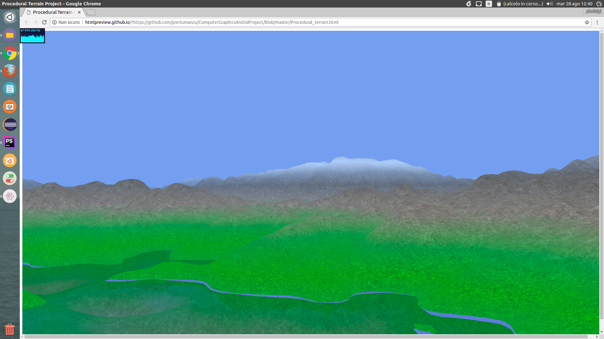

# Procedural Terrain using Three.js

Here there is a [link](http://htmlpreview.github.io/?https://github.com/pierlumanzu/ComputerGraphicsAnd3dProject/blob/master/Procedural_terrain.html) to a preview of the application.

It is important to know that this preview runs with the parameters set as indicated in the "Procedural_terrain.js" file.

### Warning

- The use of a graphic card is required to get a good application performance. This latter depends on which graphic card is used too, but already with a card with 2 GB minimum of dedicated memory is fine.

- The inizialization of the application takes some time, that depends not only on the hardware features but also on the O.S. of your machine. Indeed, the inizialization takes about 30 seconds in Windows while in Ubuntu it takes about 1 minute and 25 seconds. I suppose that these times differ from each other because of the different implementation of the two Operating Systems. These times also depend on the parameteres set on the application. So do not despair if you see in your browser a window that indicates the waiting for the page response.

- The framerate of the application is stable on Windows on 60 FPS omitting some rare decline. On Ubuntu the framerate is less stable but guarantees equally good performance. All this, as before, depends on the hardware features of your machine and on the parameters.

- Recommended browser: Chrome. The tests revealed that Firefox takes worse performance.

### Image Example

